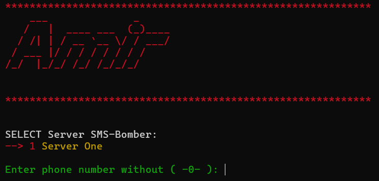

## Python SMS Sender Demo

<p align="left"> <h4 align="left">Languages and Tools:</h4><a href="https://www.python.org" target="_blank" rel="noreferrer">  </a> </p>

A Python project to send OTP or notification messages using a legal SMS API (like Twilio) for testing and learning purposes.

## Features
- Send messages to your own phone numbers for testing
- Multiple server options (simulate different endpoints)
- Colorful console output using `colorama`
- Fun ASCII art logo using `pyfiglet`
- Fully configurable via Python functions

## Requirements
- Python 3.7+
- `requests`
- `colorama`
- `pyfiglet`
- `python-dotenv` (for API credentials)

## Installation
```bash
git clone https://github.com/amirclear/X3147.git
cd sms
pip install -r requirements.txt
